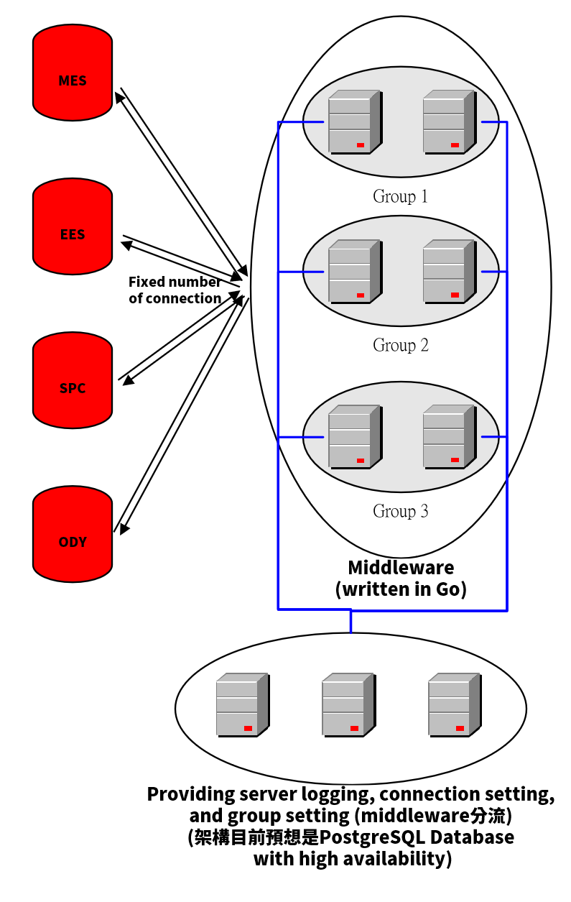

# WOT - Web Oracle Tool

##  設計目標
Web Oracle Tool (下面簡稱WOT)目標為以Oracle Database為核心，構建一系列的web services及web views，並提供自動部署、監控、主動即時的Alarm系統、Admin頁面以及重要元件HA機制，所形成的一個完整解決方案。

## 架構圖

## 系統需求

###  Web Services
###  Web View
###  自動部署
###  監控
###  主動即時的Alarm系統
###  Admin頁面
###  重要元件HA機制

